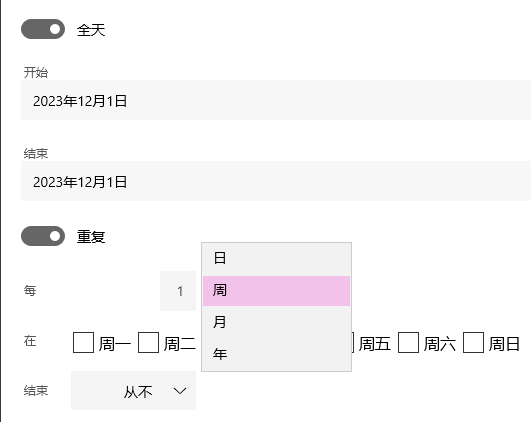

# 高效日程和任务安排工具
## OneCalendar

[官网链接](https://www.onecalendar.nl/) &emsp; 可在 MicrosoftStore 直接下载 UWP版本

连接 Google，Microsoft 等账户，连接账户旗下的 Calendar

1. 可以跨设备免费同步日程
2. 批量设置 周几，隔几周；一月中的几日，隔几月 等等

    
3. 设置提醒时间：无提示 或 日程开始 0~2 周后提醒
4. 显示直观，可以日，周，月，年单位显示

## OneTask

